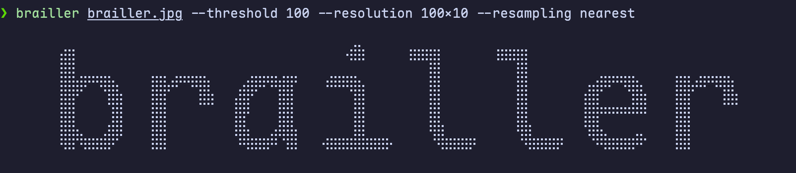

# Brailler — Braille Art Generator



**Brailler** is a command-line utility written in Python that converts any image into Braille-based text arts. (like ASCII art)

Each Braille character contains up to 8 dots, allowing for a higher "resolution" compared to standard ASCII art. This makes brailler much better for creating detailed text-based graphics.

---

## Features

- Converts PNG/JPG images into Braille-based art
- Adjustable output size
- Configurable binarization threshold for better contrast
- Color inversion
- Verbose mode for processing details

---

## Installation
### Via pip/pipx
```bash
pipx install git+https://github.com/wandderq/brailler@main
```

## Usage
### Basic example
```bash
brailler input.jpg
```

### Specify output size
```bash
brailler input.jpg --resolution 100x50
```

### Adjust binarization threshold
```bash
brailler input.jpg --threshold 222 
```

### Invert colors & change resampling algorithm
```bash
brailler input.jpg --resampling nearest --invert
```


## Command-line arguments
| Argument           | Description                                                 |
|--------------------|-------------------------------------------------------------|
| `input`            | Input image file path                                       |
| `-r, --resolution` | Output resolution characters (format: WxH) (default: 40x18) |
| `-t, --threshold`  | Binarization threshold (0-255) (default: 210)               |
| `-R, --resampling` | Image resampling algorithm (default: lanczos)               |
| `-i, --invert`     | Invert image colors                                         |
| `-v, --verbose`    | Verbose mode (INFO and DEBUG logs)                          |

## Requirements
### Common
- `python>=3.12`
- `pillow>=12.1`
- `colorlog>=6.10.1`

### Build & develop
- `ruff>=0.16.7`
- `uv>=0.12.15`
- `uv_build>0.11,<0.12`

## License
This project is licensed under the MIT License. See the [LICENSE.md](https://github.com/wandderq/brailler/blob/main/LICENSE.md) file for details

